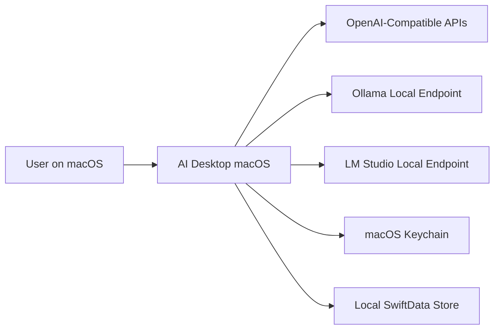
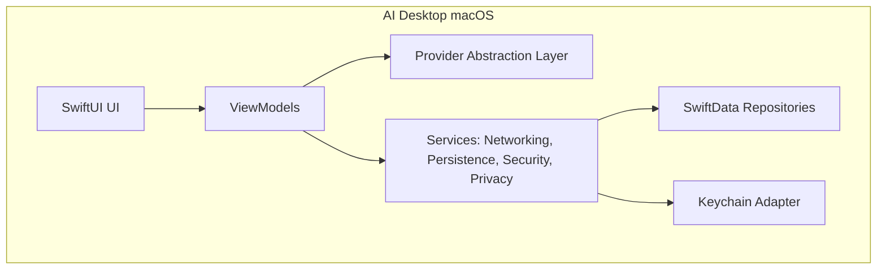

# C4 Architecture

## Context (L1)

## Container (L2)

## Component (L3)

- UI Components: sidebar, conversation pane, composer, top bar.
- ViewModels: provider settings VM, conversation VM, privacy VM.
- Provider adapters: OpenAI-compatible adapter, Ollama adapter, LM Studio adapter.
- Infrastructure adapters: URLSession client, SwiftData repository, Keychain repository, shortcut manager.

## Boundary Rules

- UI only talks to ViewModels.
- ViewModels depend on abstractions, not concrete provider implementations.
- Provider adapters do not manage persistence directly.

## Related

- [[High_Level_Architecture]]
- [[Modular_Domains]]
- [[Provider_Abstraction]]
