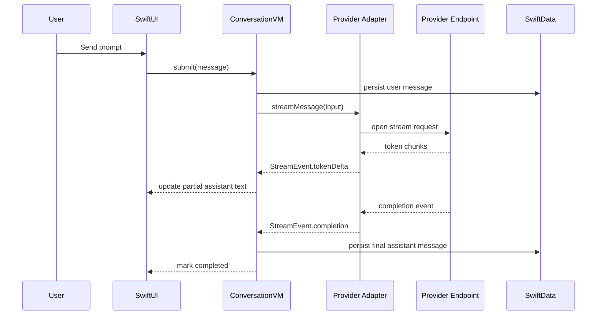

# Sequence Streaming

## End-to-End Sequence

## Cancellation Sequence

- User cancels from UI.
- VM cancels stream task immediately.
- Partial assistant content is finalized with `streamState = canceled`.
- UI returns to idle and preserves draft context.

## Failure Sequence

- Provider/network error triggers unified error mapping.
- Partial content remains when safe.
- User gets retryable action if eligible.

## Related

- [[Networking_and_Streaming]]
- [[State_Machines]]
- [[Error_Model]]
