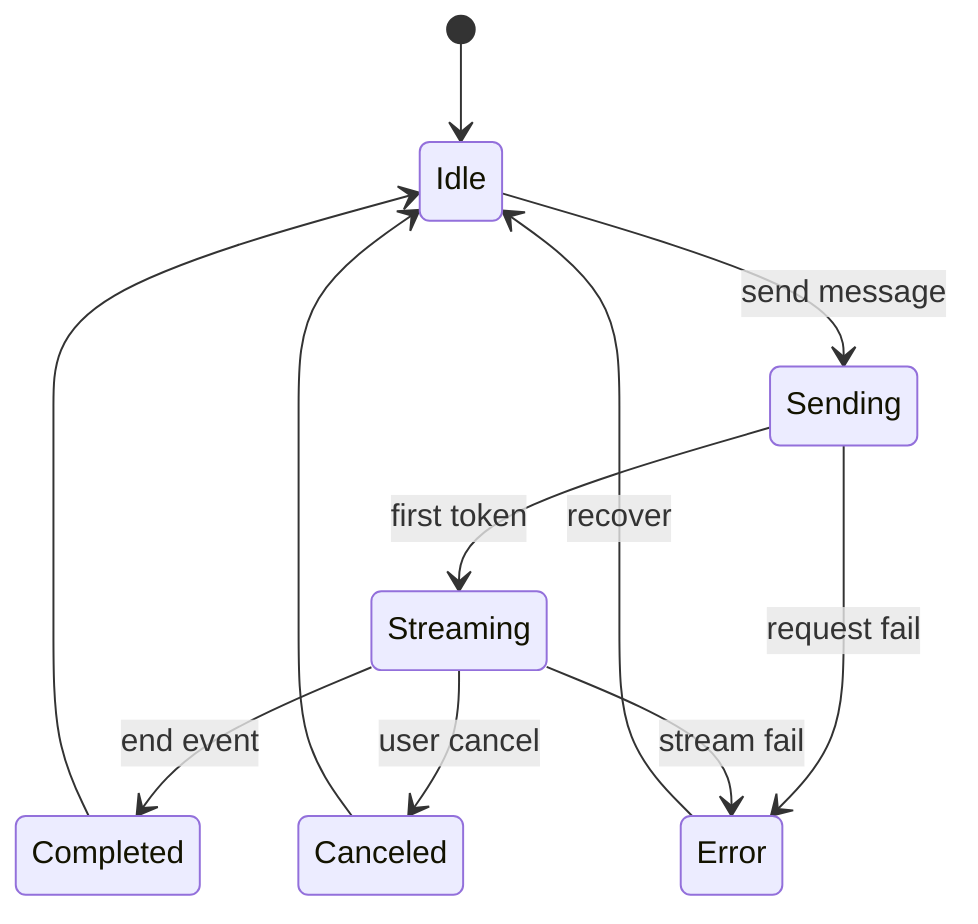
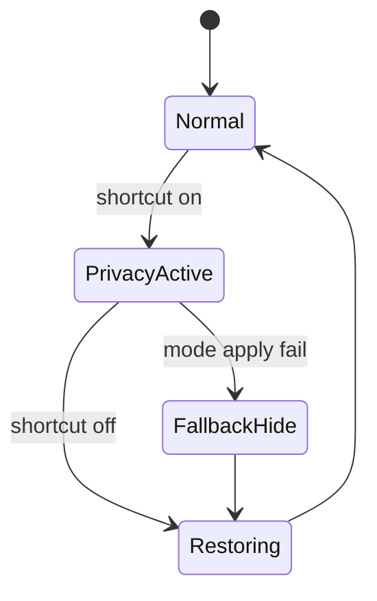

# State Machines

## Conversation Streaming State

## Privacy State

## State Invariants

- Only one streaming operation per conversation at a time.
- Privacy active state must prevent readable content exposure.
- Cancel operation cannot create duplicate assistant messages.

## Related

- [[Flow_Start_Conversation]]
- [[Flow_Privacy_Mode]]
- [[AC-003]]
- [[AC-005]]
- [[AC-006]]
